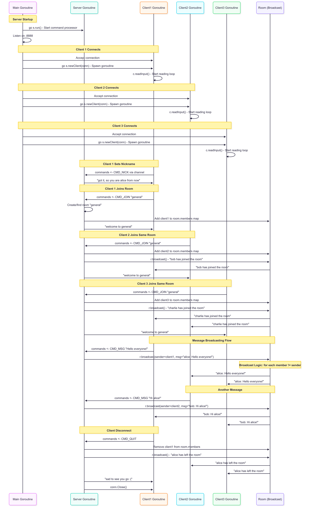
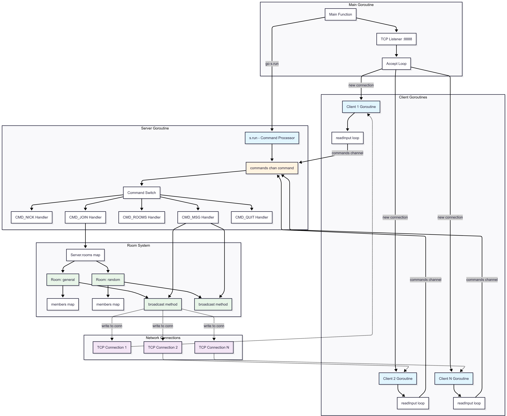

# Go TCP Chat Server

A simple TCP-based chat server written in Go that supports multiple clients, chat rooms, and real-time messaging using goroutines and channels.

## Features

- **Multi-client support** - Handle multiple concurrent connections
- **Chat rooms** - Create and join different chat rooms
- **Real-time messaging** - Instant message broadcasting to all room members
- **User nicknames** - Set custom display names
- **Command-based interface** - Simple commands for interaction
- **Goroutine-based architecture** - Efficient concurrent handling

## Architecture

The application uses a goroutine-per-client model with a central command processor:

- **Main goroutine** - Accepts new TCP connections
- **Server goroutine** - Processes all commands sequentially via channels
- **Client goroutines** - One per connected client, handles input reading
- **Channel communication** - Thread-safe message passing between goroutines

### User Flow


### System Architecture


## Quick Start

### Prerequisites

- Go 1.24.2 or later

### Installation

1. Clone the repository:
```bash
git clone https://github.com/Jayant-issar/go-tcp-chat.git
cd go-tcp-chat
```

2. Run the server:
```bash
go run .
```

The server will start listening on port `8888`.

### Connecting

Connect using any TCP client (telnet, netcat, etc.):

```bash
telnet localhost 8888
# or
nc localhost 8888
```

## Commands

| Command | Description | Example |
|---------|-------------|---------|
| `/nick <name>` | Set your nickname | `/nick alice` |
| `/join <room>` | Join or create a room | `/join general` |
| `/rooms` | List all available rooms | `/rooms` |
| `/msg <message>` | Send message to current room | `/msg Hello everyone!` |
| `/quit` | Disconnect from server | `/quit` |

## Usage Example

```
# Client 1
/nick alice
/join general
/msg Hello everyone!

# Client 2  
/nick bob
/join general
/msg Hi alice!

# Client 3
/rooms
/join general
/msg Hey folks!
```

## Project Structure

```
.
├── main.go      # Entry point and TCP listener
├── server.go    # Server logic and command handlers
├── client.go    # Client structure and input handling
├── room.go      # Room management and message broadcasting
├── command.go   # Command definitions and types
└── go.mod       # Module definition
```

## How It Works

### Connection Flow

1. Server listens on TCP port 8888
2. Each new connection spawns a client goroutine
3. Client goroutine runs an infinite loop reading user input
4. Commands are sent via Go channels to the server goroutine
5. Server processes commands sequentially (thread-safe)

### Message Broadcasting

1. Client sends `/msg` command
2. Server identifies the client's current room
3. Room broadcasts message to all members except sender
4. Each client receives the message on their TCP connection

### Goroutine Communication

```
Client Goroutines → commands channel → Server Goroutine
                                          ↓
                    Room.broadcast() → All other clients
```

## Architecture Diagrams

The system uses the following architecture:

**Message Flow:**
- Client goroutines communicate with server via channels
- Server processes all commands sequentially
- Rooms handle message broadcasting to multiple clients

**Concurrency Model:**
- One goroutine per client connection
- Single server goroutine for command processing
- Channel-based communication prevents race conditions

## Code Highlights

### Concurrent Client Handling
```go
// Each client gets its own goroutine
go s.newClient(conn)
```

### Channel-Based Communication
```go
// Commands flow through channels
c.commands <- command{
    id:     CMD_MSG,
    client: c,
    args:   args,
}
```

### Room Broadcasting
```go
// Messages broadcast to all room members except sender
for addr, m := range r.members {
    if addr != sender.conn.RemoteAddr() {
        m.msg(msg)
    }
}
```

## Contributing

1. Fork the repository
2. Create a feature branch
3. Make your changes
4. Add tests if applicable
5. Submit a pull request

## License

This project is open source and available under the [MIT License](LICENSE).

## Future Enhancements

- [ ] Private messaging between users
- [ ] Persistent chat history
- [ ] User authentication
- [ ] Web-based client interface
- [ ] Message encryption
- [ ] Room moderation features
- [ ] File sharing capabilities

---

**Built with ❤️ in Go by Jayant Issar**
